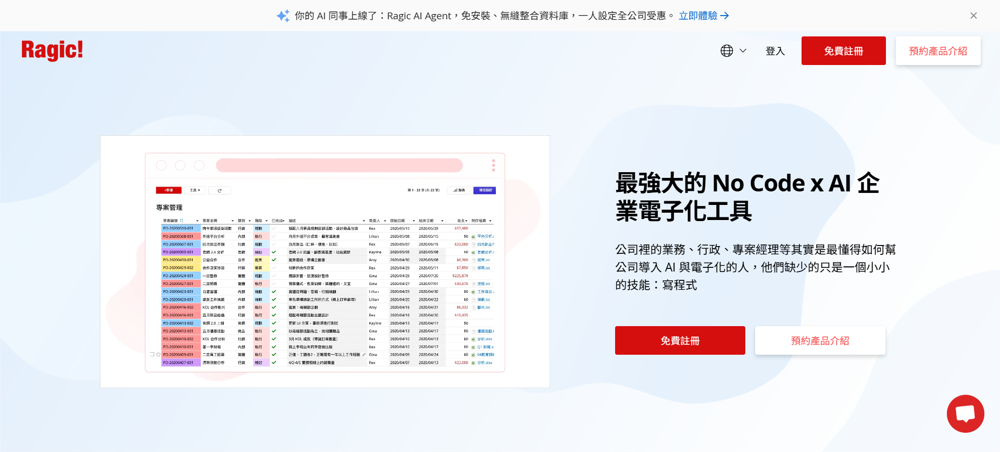
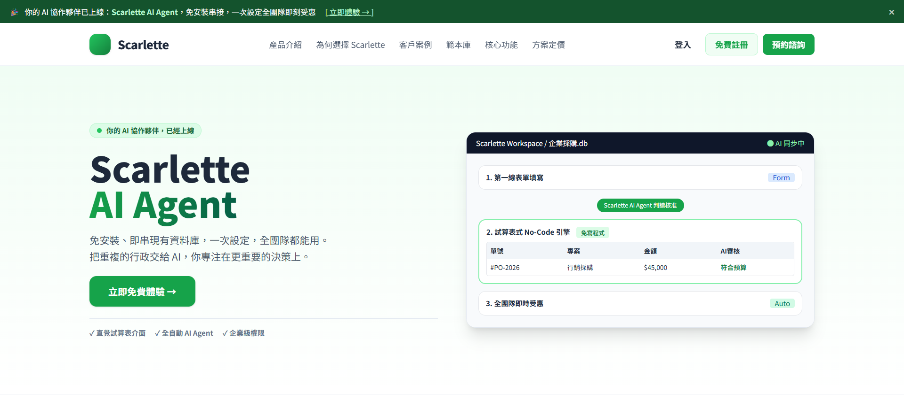
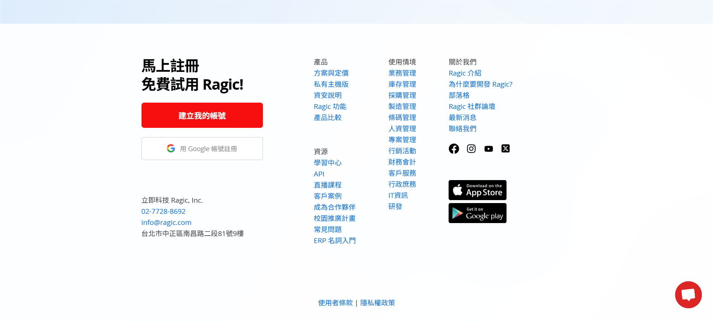
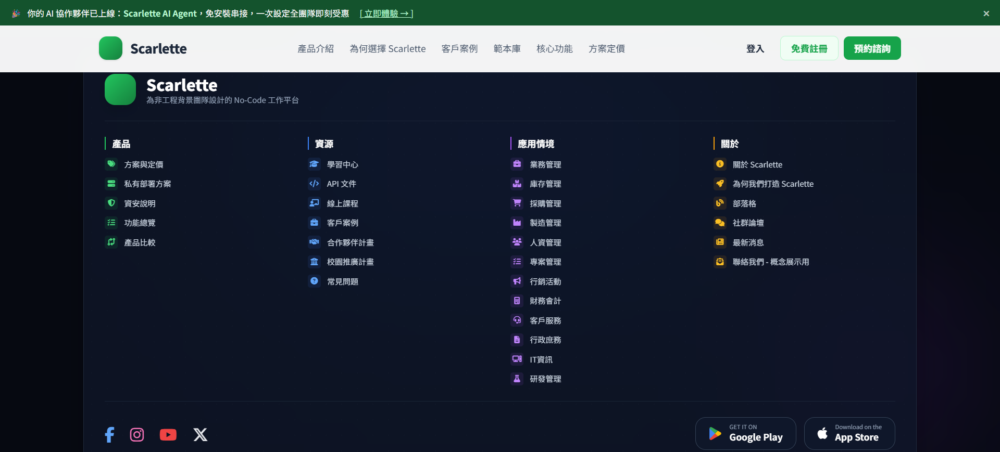

# 🎨 Scarlette Concept Project | 企業級 No-Code 平台 UI Redesign (MVP)


> 🔗 **Live Demo:** [前往 Scarlette Concept 線上展示](https://s1116032.github.io/scarlette-concept-redesign-public/)
> 🌐 **Original Inspiration:** [Ragic 企業雲端資料庫](https://www.ragic.com/)

## 📖 關於本專案 (About)

`Scarlette Concept Project` 是一個前端作品集的 **MVP (Minimum Viable Product)** 專案。

為了展現前端切版技術與現代 UI/UX 視覺設計能力，我挑選了市面上優秀且功能強大的 No-Code 企業雲端資料庫 [Ragic](https://www.ragic.com/) 作為靈感來源。原產品在企業系統與表單設計上非常成熟，本專案則是以虛擬品牌 "Scarlette" 為名，探索這類企業級產品在導入「AI Agent」概念後的現代化視覺語言。

**⚠️ 專案狀態：**
為求聚焦於前端視覺與互動呈現，**本專案目前僅完成首頁 (Landing Page) 的重新設計與開發**，作為前端技術與設計思維的展示。

---

## 🔄 Before & After (視覺對照)

| 原版網站 (Original Ragic) | 重新設計 (Scarlette Concept) |
| :---: | :---: |
| <br>*首頁 Hero Section* | <br>*首頁 Hero Section* |
| <br>*功能列表與應用情境* | <br>*功能列表與應用情境* |

---

## ✨ 首頁設計亮點 (Highlights)

以原版首頁的結構為基礎，本次 Redesign 在視覺與資訊呈現上做了以下重構：

*   **🎨 綠色系品牌色彩系統**：以層次化的綠色取代原版紅色主調——深綠色公告列、mint 漸層 Hero 背景、綠色 CTA 與狀態指示——並透過 CSS Variables 統一管理全站色彩，建立虛擬品牌 "Scarlette" 的視覺識別。
*   **📐 Hero 資訊層級重構**：將原版「左圖右文」調整為「左文右 Mockup」，以雙行特大標題 "Scarlette / AI Agent" 作為視覺焦點，搭配 pill 狀態徽章與三個 checkmark 賣點（直覺試算表介面、全自動 AI Agent、企業級權限），讓主訴求在三秒內可被讀完。
*   **🧩 產品畫面抽象為三步驟工作流**：原版 Hero 嵌入資訊密度較高的真實試算表截圖；本專案將其重繪為 "Scarlette Workspace / 企業採購.db" Mockup 卡片，以「第一線表單填寫 → AI Agent 判讀核准 → 全團隊即時受惠」三步驟敘述核心價值，並用單列迷你表格（AI審核：符合預算）具體呈現 AI 的輔助成果。
*   **💊 現代 SaaS 元件語言**：語義化標籤 pill（Form / 免寫程式 / Auto）、深色 Workspace 標題列搭配 "AI 同步中" 狀態點、圓角卡片與細緻陰影，營造輕量但具信任感的企業產品氛圍。
*   **📱 響應式佈局 (RWD)**：Hero 雙欄與工作流卡片於行動裝置自動調整為堆疊排列，維持閱讀與操作流暢度。

---

## 🛠️ 技術棧 (Tech Stack)

*   **Frontend:** HTML5, CSS3, JavaScript
*   **Design:** Figma (UI/UX Wireframe)
*   **Hosting:** GitHub Pages
*   **Version Control:** Git

---

## ⚠️ 免責聲明與版權宣告 (Disclaimer)

1.  **純作品集展示**：本專案 `Scarlette Concept Project` 僅為個人前端技術與 UI/UX 設計之**作品集展示 (Portfolio Concept)** 使用。
2.  **無商業關聯**：本網站與 [Ragic Inc.](https://www.ragic.com/) **無任何商業合作、贊助或關聯**。
3.  **版權歸屬**：原產品之商標、服務、概念與版權皆歸原公司所有。本 Redesign 專案純粹為設計交流與技術展現，不作任何商業營利之用。

---

## 🚀 如何運行 (How to Run)

本專案已部署於 GitHub Pages，您可以直接點擊上方的 **Live Demo** 連結觀看。

若要在本地端運行：
```bash
# 1. 複製專案
git clone https://github.com/[你的-Github-ID]/scarlette-concept-redesign.git

# 2. 進入資料夾
cd scarlette-concept-redesign

# 3. 使用 Live Server 或任何靜態伺服器啟動
# 例如使用 Python
python -m http.server 8000
```

---

## License
Copyright © 2026 hanwu910514.

詳情請參閱[Apache License 2.0](LICENSE)檔案
